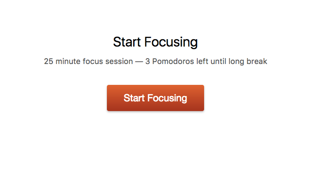
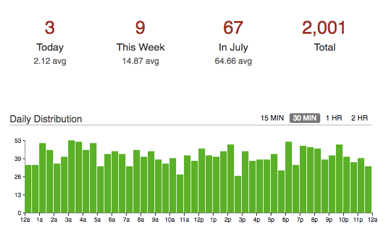
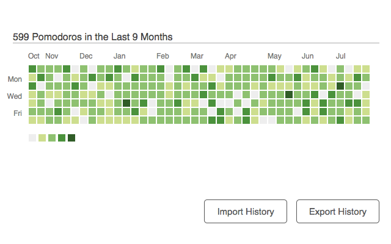
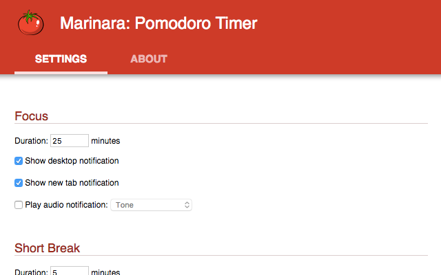
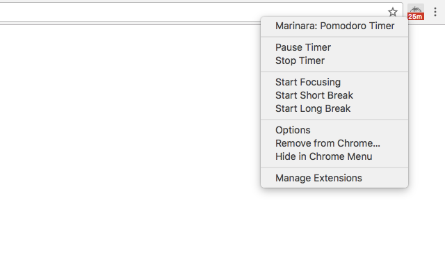
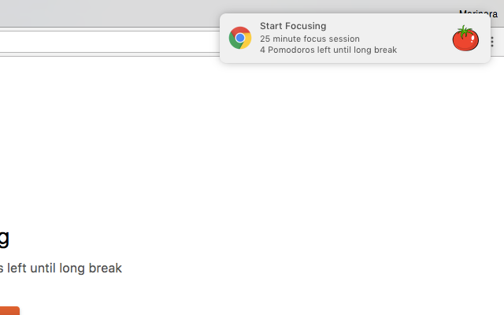
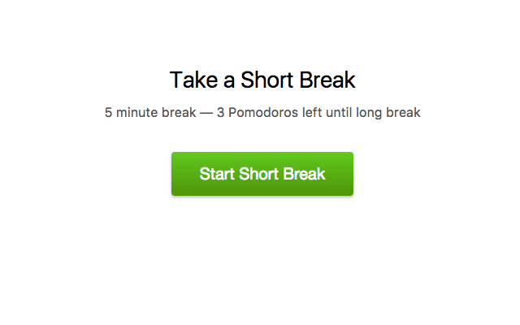

# Marinara: Pomodoro® Assistant

Marinara is a [time management assistant for Chrome](https://chrome.google.com/webstore/detail/marinara/lojgmehidjdhhbmpjfamhpkpodfcodef) that follows the [Pomodoro Technique](https://en.wikipedia.org/wiki/Pomodoro_Technique).

Pomodoro® and The Pomodoro Technique® are trademarks of Francesco Cirillo. Marinara is not affiliated or associated with or endorsed by Pomodoro®, The Pomodoro Technique® or Francesco Cirillo.

## Features

- Short & long breaks
- Toolbar icon with countdown timer
- Track Pomodoro history & stats
- Configurable long break intervals
- Configurable timer durations
- Desktop & tab notifications
- Audio notifications with over 20 sounds
- Ticking timer sounds
- Scheduled automatic timers
- Open source software

## Screenshots

## Developer Setup

Currently, Marinara is configured for developers working and packaging releases on Mac OS. Support for Linux or Windows is welcome.

Marinara uses the system `ruby` and `make` tools to build releases.

It also uses [jq](https://stedolan.github.io/jq/) to manipulate the `manifest.json`. You can quickly install it using [Homebrew](https://brew.sh/):

    brew install jq

Once installed you can package a release by running:

    make package

This will produce a packaged extension ready for uploading to the Chrome Web Store in the root directory of the project.

## License

Pomodoro® and The Pomodoro Technique® are trademarks of Francesco Cirillo. Marinara is not affiliated or associated with or endorsed by Pomodoro®, The Pomodoro Technique® or Francesco Cirillo.

Copyright &copy; 2015 Chris Schmich  \
MIT License. See [LICENSE](LICENSE) for details.
